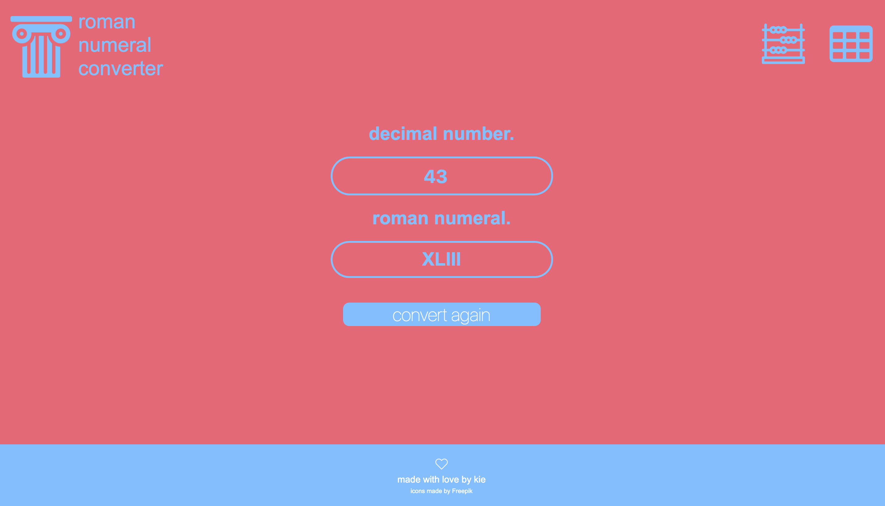

Roman Numerals Converter
=================
[](https://travis-ci.org/kiedunne/roman-numeral-converter)
[](https://codecov.io/gh/kiedunne/roman-numeral-converter)

<p align="center"></p>

A simple roman numerals converter app made to practice TDD principles and deployment.

Deployed at https://roman-numeral-converter-kie.herokuapp.com


### Local Setup

```
git clone https://github.com/kiedunne/roman-numerals-converter
bundle install
rackup config.rb
open localhost:4567 in any web browser
```

### Testing
Run all tests with spec. Code coverage is 100%.
```
run rspec
```

### User Stories:

```
As a user,
So I can know what roman numeral represents my decimal number,
I want to convert my number to a roman numeral.
```

```
As a user,
So I can know the characters for each roman numeral,
I want to see a table with decimal and roman characters.
```

### Technology:

* Ruby
* RSpec
* Capybara
* Rubocop
* SimpleCov
* Heroku
* Travis CI
